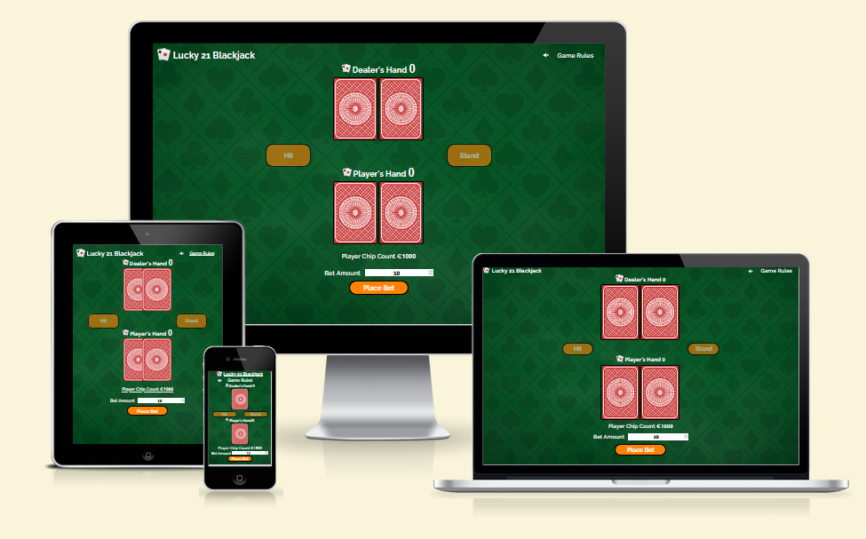
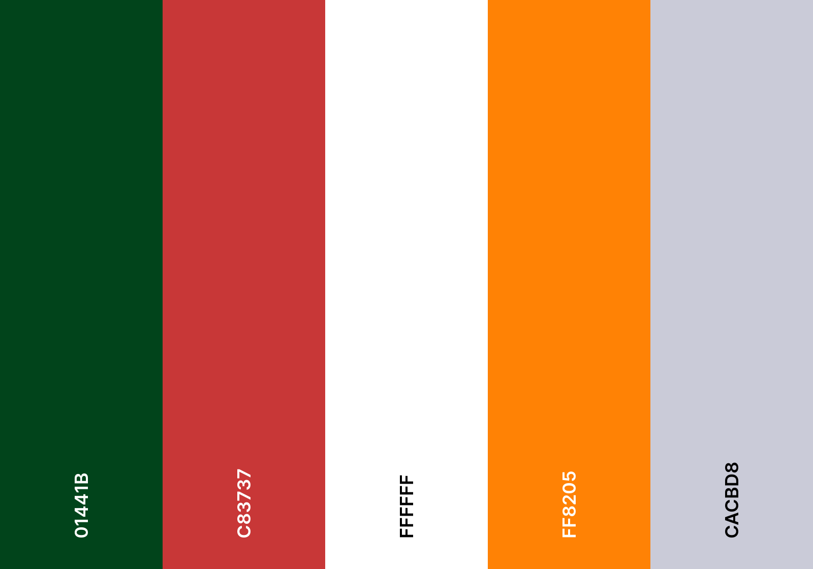
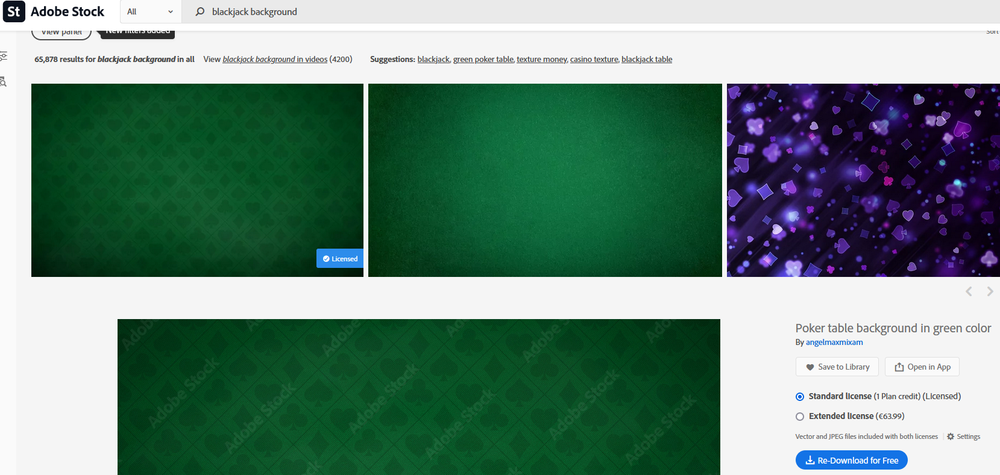

# Lucky 21 Blackjack
The Lucky 21 online game was designed to allow the user a place to practice and hone their Blackjack skills. 

[Lucky 21 Blackjack Online Game](https://garydolan.github.io/ci-p2-blackjack/)

# Table of Contents
1. [Introduction](#Lucky-21-Blackjack)
2. [User Experience](#user-experience)
    * [Initial Discussion](#initial-discussion)
    * [User stories](#user-stories)
3. [Design](#design)
    * [Colour scheme](#colour-scheme)
    * [Typography](#typography)
    * [Imagery](#imagery)
    * [Wireframes](#wireframes)
4. [Features](#features)
    * [Common to all](#common-to-all-pages)
    * [Game page](#Game-page)
    * [Header](#Header)
    * [Game rules modal](#Game-rules-modal)
    * [Dealer section](#Dealer-section)
    * [Game controls](#Game-controls)
    * [Player section](#Player-section)
    * [Betting section](#Betting-section)
    * [Play again button](#Play-again-button)
    * [Modal pop up box](#Modal-pop-up-box)
    * [404 page](#404-page)
    * [Game Functionality](#Game-functionality)
    * [Future Implementations](#future-implementations)
    * [Accessibility](#accessibility)
5. [Technologies used](#technologies-used)
    * [Languages](#languages)
    * [Version control](#version-control)
    * [Programs](#programs)
    * [Tools](#tools)
6. [Deployment & Local Deployment](#deployment--local-deployment)
    * [Deployment](#deployment)
    * [Local Deployment](#local-deployment)
        * [How to Fork](#how-to-fork)
        * [How to Clone](#how-to-clone)
7. [Testing](#testing)
    * [Automated testing](#automated-testing)
    * [Manual testing](#manual-testing)
    * [Lighthouse testing](#lighthouse-testing)
    * [User story testing](#user-story-testing)
    * [Bugs](#Manual-testing-bugs)
8. [Credits](#credits)
    * [Copy](#copy)
    * [Imagery](#Images)
    * [Code](#code)
    * [Acknowledgements](#acknowledgements)

# User Experience

## Initial Discussion
Lucky 21 Blackjack is an online game that I (Gary Dolan) developed for my second project as part of Code Institutes Diploma in Full Stack Software Development. The online games target audience is people interested in learning to play blackjack, people looking to practice to improve their blackjack skills and people looking to just play blackjack for fun. The online game will provide the user with an easy to use intuitive game interface that has simple controls. The online game will also allow the user to simulate betting so they can become accustom to how betting  in a real blackjack game works. 

## User stories

### Owner / Client goals
* To ensure the user can easily and intuitively use the online game.
* To create an online game that encourages first time learning, keeping consistent colouring and imagery across all game features.
* To create an online game that encourages the user to relax, have fun and enjoy themselves, using colouring, imagery and light hearted and informal text.
* To provide the user with all the information needed to play the game, ensuring that all players, regardless of skill level can enjoy the game.
* To create an online game that encourages users to visit often and enjoy playing. 
* To ensure that the user regardless of their actions cannot cause any issues with the game.
* To create an online game which is playable on a large array of devices. 
* To create a high level of user feedback while playing the online game, ensuring the user knows where they can and when the have interacted with the online game.
* To create an online game with a high level of accessibility so that all users regardless of capacity can play and enjoy it. 

### First time visitor goals
* I want to learn about blackjack and how to play.
* I want to play blackjack and practice my skills.
* I want the game to be intuitive and easy to play.
* I want the game to provide me with feedback regarding actions I can take or actions I have taken. 
* I want the ability to place bets when playing.

### Returning visitor goals 
* I want to play blackjack.
* I want the game to be familiar and to remember all the functionality immediately.
* I want to be able to place bets and try win larger amounts of chips.
* I want the ability to play the online game on all my devices.

[Return to Table of Contents](#table-of-contents)

# Design
## Colour scheme
The primary objective I wanted to achieve with my colour scheme was to invoke a sense of familiarity in the players. Blackjack is a well known and loved game so I wanted to choose colours that players would expect. I also wanted to choose some colours that the players would not be used to seeing so that it would immediately draw their attention. These colours would be used for calls to action. 

A secondary goal of my colour scheme was to give the appearance of quality. I didn't just want to use solid colours but textured and high quality images where practical.

Another goal of my colour scheme was to ensure that the users we not overwhelmed or distracted by it. I used darker colours were possible, and backgrounds and images that would not distract the player. This ensures the players could relax and play the game for long periods of time if they choose to. 

Due to the darker game, backgrounds I wanted to use white text where possible to ensure there would be good contrast between them and would not distract the player. 

I based my colour palette largely around the existing colours of most versions of blackjack. I initially choose the background image and then selected colours that would complement this and also comply to WCAG standards. I also used [Coolors](https://coolors.co/) to visualise my palette. 

* #01441B: This is one of my primary colours chosen based on the background image I choose to simulate a blackjack table.
* #C83737: This is another one of my primary colours chosen for the rear of the playing cards, again a very common colour used in blackjack.
* #FFFFFF: This is one of my secondary colours intended for use in most if not all of my text content.
* #FF8205: This colour was chosen for use in my button as a strong stand out colour for calls to action.  
* #CACBD8: Selected for use in elements which require user feedback such as the game rules modal or home icon. 

All intended colour combination from my pallet were tested on [Webaim](https://webaim.org/resources/contrastchecker/) and [Accessible web](https://accessibleweb.com/color-contrast-checker/) to ensure any text displayed on another colour complied with WCAG AAA standards.

I had one small issue when contrasting the text and background. This was with regards to the button text. I originally planned to use a darker text colour, such as #383838 in the buttons to ensure full compliance. When I used darker colours I found that although they were visible against their immediate background, they were harder to see due to the dark colour of the game background. I spoke to my class mates and my cohort facilitator and all agreed that a brighter coloured text gave much better visibility against the orange button and the green background image that the darker colours.  

## Typography
When considering fonts, I used a combination of [Google fonts](https://fonts.google.com/) to research fonts, [Font joy](https://fontjoy.com/) to compare various fonts. I decided to use a font I had used on a previous project called Raleway because it was clean and elegant and offered a wide variety of weights.

I did change this font to sans-serif in two places in my code where numbers were used as then number sat too low against the text and created a bad visual style. I used sans-serif for the player and dealer hand value number and for the player chip count number.

## Imagery
Due to the nature of blackjack I did not need to use many images in my game. 

My first image was the background image for the game. This would be a large visual aspect of the game so I wanted to ensure I choose one that was very high quality and would not be too distracting. I choose to licence an [image](https://stock.adobe.com/ie/search?k=blackjack+background&asset_id=325384191) from [Adobe Stock](https://stock.adobe.com) and have included an image for proof of licensing. 

My next [images](https://opengameart.org/content/playing-cards-vector-png) were for the placing card faces, there are 52 in total and I downloaded them under public domain license from [OpenGameArt.Org](https://opengameart.org).

The final two images I used were from [Pixabay](https://pixabay.com/). The first [image](https://pixabay.com/vectors/card-card-game-playing-card-game-7031432/) was used for the back of my playing cards and the second [image](https://pixabay.com/vectors/cards-poker-game-heart-spade-icon-98382/) was used as an icon in my logo and in two other places in the game. This image was converted to an icon using [Favicons convertor](https://favicon.io/favicon-converter/).

## Wireframes
All the wireframes for the online game were created using the Balsamic desktop application. They were also created for specific breakpoint, which I took from [am I responsive](https://ui.dev/amiresponsive). 

Desktops - 1600 x 992px

Laptops - 1280 x 802px

Tablet - 768 x 1024px

Mobile - 320 x 480px 

There were some deviations from the above wireframes as the game was developed including the removal of the message display section, which was replaced by modal pop ups.

[Return to Table of Contents](#table-of-contents)

# Features
The online game contains 2 pages in total. There is one game page and a 404 page. The online game is fully responsive and will work on a range of devices. 

## Common to all pages

### Logo
The logo is common on both pages of the online game. The logo consists of an icon and matching text and is a link to return to the game page. The logo also provides feedback to the user, changing colour when the user mouses over it. At mobile sizes the icon is removed from the logo. 

### Background
The background image is a high quality textured image that is used on both game pages for consistency.   

## Game page
The game page is the page that contains the game, all of its functionality and interactivity. It consists of a background image (discussed above) which covers the entire page, a header containing a logo and a game rules pop up, a dealer section containing the dealer's information and cards, a game controls section containing the hit and stand buttons, a player section containing the player's information, cards and chip count and finally a betting section which contains the betting input and the place bet button. 

The game page can also contain a play again button if the player runs out of chips and can no longer continue their game. This button is displayed in place of the betting section. 

At times the game page may also contain pop up windows. The windows messages will change based on the information that needs to be displayed and will scale based on the device size.

## Header
The header of the online game consists of a logo and game rules text. The logo consist of an icon and matching text and is a link to return to the game page. The logo also provides feedback to the user, changing colour when the user mouses over it. At mobile sizes the icon is removed from the logo. The game rules text is clickable and when clicked it will display a game rules modal. The game rules text also provides feedback in the form of a colour change when the user mouses over it. 

## Game rules modal
The games rule modal can be accessed by clicking game rules in the header. Once clicked a pop up modal will appear and display the game rules to the user. The popup will contain an x and an OK button, either of these can be pressed to close the modal. The modal will also place a slightly opaque image over the game in places not occupied by the modal message. The game is not playable and has no interactivity when the game rules modal is displayed. At mobile sizes the modal will adapt and allow scrolling so that the rules can be read fully.

## Dealer section
The dealer section of the online game contains the dealer's information and the dealer's cards. The dealer's information consists of an icon followed by the dealer's hand text and finally a number representing the dealer's hand value. At the beginning of the game the dealers hand value will be zero and their cards will be face down. The card images in the dealer's section will overlap more and more as the page size decreases. 

As the game progresses and the dealer deals the card's the dealer will show one card and keep one card face down, the value of the dealers hand will also be displayed without the value of the face down card.

Once the game reaches the point where the player finished playing, the dealer's hand is revealed and the value of all the dealers cards will be displayed. At this point the dealer may take more cards, these will be added next to the existing cards in their hand. 

## Game controls
The game controls section consists of a hit and a stand button. These buttons are used by the player to make decisions about how they would like to play the game. Initially these buttons will be dulled down in colour and their functionality will be disabled. At this point the user will not be able to interact with them. 

Once the player places a bet and the cards are dealt these buttons will be made available and return to their normal colour. Once available the buttons will provide feedback (colour change) to the user when moused over. 

When the hit button is pressed the dealer will deal another card to the player and this will be added to the players hand and their total hand value will be updated. The user can choose to hit once their hand value does not exceed 21. 

When the player presses the stand button it will signal that they do not wish to be dealt any more cards. At this point the hit and stand buttons will be disabled again and the game will continue.   

## Player section
The player section of the online game contains the player's information, the player's cards and the players chip count. The player's information consists of an icon followed by the player's hand text and finally a number representing the player's hand value. At the beginning of the game the player's hand value will be zero, their cards will be face down and their chip count will be set to 1000. The card images in the player's section will overlap more and more as the page size decreases. 

Once the player places a bet their chip count will be update and the dealer will deal the cards. The player will be dealt two cards face up and their hand value will be updated. 

If the player uses the hit button cards will be added to their hand and displayed alongside their current cards, the hand count is also updated each time they receive a card. The player chip count will also be updated when the player wins a game. 

## Betting section
The betting section of the game consists of a betting input and a place bet button. 

When the games starts the player's focus will be drawn to the bet amount input. This input allows the player to enter an amount they wish to bet on the upcoming game. The amount they enter will be placed as a bet and cards will be dealt once they press enter or click the place bet button. The input will only accept bets in increments of 10, from 10 to the players chip count. If the user enters anything other than this a modal will be displayed informing them that their bet is invalid. If a player enters a bet amount larger than there chip count, the game will automatically reduce their bet to their max chip count and inform them of this via a modal pop up.

## Play again button 
The play again button is only shown when a player's game has ended due to their chip count being too low to place a bet. The play again button will replace the betting input section and the player chip count. As the name suggests when the button is clicked a new game will start. Like all other buttons this one provides feedback via colour changes.

## Modal pop up box
The game will provide the player with valuable information throughout the course of the game in the form of a pop up modal. This modal will have the same style regardless of the message but will scale to the message size. Below is a list of all the modal messages that can be displayed in the game.

### Game rules modal
This modal has already been discussed [above](#Game-rules-modal). 

### Win
This modal is displayed when the player wins. A win occurs when the players hand value is closer to 21 than the dealer and neither they nor the dealer bust (go above 21).

### Lose
This modal is displayed when the player loses. A loss occurs when the player is further away from 21 than the dealer and neither they nor the dealer bust (go above 21).

### Bust
This modal is displayed when the player busts. A player is considered bust when there hand value exceeds 21.

### Blackjack
This modal is displayed when the player achieves blackjack. Blackjack occurs when a players hand count totals 21 with only the first two cards.

### Push
This modal is displayed when there is a push. A push occurs when they player and dealer's hand count match at the end of a game.

### Dealer bust
This modal is displayed when the dealer busts. A dealer is considered bust when there hand value exceeds 21. 

### No chips
This modal is displayed when the player runs out of chips due to losing games.

### Invalid bet
This modal is displayed when a player enters a non valid input into he betting input and places the bet (presses enter or clicks the place bet button). A valid bet is a number above 0 in increments of 10. Anything besides this (abc, ==-, 101 etc.) will trigger this modal.

### Bet exceeds chip count
This modal is displayed when the player enter places a valid betting amount that exceeds their chip count in the betting input and places the bet. 

## 404 page
The 404 page is the page the user will be directed to if they try to visit a page that doesn't exist. It is used as feedback to let the user know that something has gone wrong and provide them with a home button back to safety (game page).

## Game functionality 
Below is a summary of the game functionality broken down into sections.

### Game startup
Once the page has loaded the game will begin initialisation and start up. At this point the dealer and player's card will be face down, the hit and stand buttons will be disabled and the users focus will be placed on the betting input. 

### Placing a bet
Once the player has the minimum amount needed (10) to place a bet they can play the game, if not they will be given the option to play again via an onscreen button and be given 1000 chips. The player can then enter their bet into the betting input field and press the place bet button (or press enter). 

If the bet is invalid the user will receive a message indicating this and they can then enter a valid bet. A valid bet is a number from 10 up in increments of 10. If for any reason the user places a valid bet that is larger than their chip count the bet amount will be reduced to the players chip count and placed (the user will be informed of this). 

### Player play
Once a bet has been placed the betting input and place bet button will be disabled. Cards will then be dealt to both the dealer and the player one by one with one second gaps between cards, the dealers first card will remain hidden.

Once the dealer and player have been dealt two cards each, the hit and stand buttons will be enabled. The player then has two options hit or stand. 

If the player chooses the hit button the dealer will deal them another card and their hand value will be update. The player can continue to hit until they bust (hand value > 21) at which point all user interactivity will be disabled, the player will be notified they bust and a new game will start 3 seconds later.  

The player can choose the stand option once they no longer want to be dealt any more cards. This will end the players play and disable the hit and stand buttons.

### Dealer play 
Once the player stands the dealer play commences. The dealer will reveal their hold (hidden) card and their hand value will be updated to include this cards value. 

If the dealers hand value is 17 they will stand and the game results will be evaluated.

If the dealers hand is below 17 they must draw cards until their hand value is 17 or above.

If while drawing cards the dealer's hand value becomes greater than 21 they will bust and the game results will be evaluated.

### Game results
Once the dealer busts or stands the game results will be evaluated to find the winner. 
* If the dealers hand value was greater than 21 they will bust and the player will win.
* If the player and dealer's hand values match it is considered a draw (push).
* If the players hand value is higher than the dealer's at this point the player wins.
* If the players hand value is lower than the dealer's at this point the player loses. 

### Display results and collect winnings
Based upon the game results above the game will no display a message informing the player of the results. At this point if the player has won their chip count will update to include their winnings. Player winnings is based on how the player won,
* Standard win 1:1 odds, player receives double the amount the bet.
* Push (draw) player received their bet back.
* Blackjack win 3:2 odds, player receives 2.5 times the amount they bet.

3 seconds after this a new game is started. 

## Future implementations
In the future I would like to add the following features to the online game
* Functionality for splitting a players hand.
* Animations that flip the cards when dealt.
* Background music, card dealt sound, win and loss sounds (all off by default).
* Update the betting section so that it used images of chips for betting.
* Add an option for the user to select the number of deck that are used in the game
* Add local storage so that the player's game progress (chip count) could be saved.
* Add a player scoring system that would show player's largest chip counts.
* Update functionality so that upon player getting blackjack the dealers cards are checked for blackjack before the player wins.

## Accessibility
I was conscious of accessibility throughout the entire game development process and took the following steps to ensure that the game would be as accessible as possible

* Used as much semantic HTML as possible, where relevant.
* Choose the game colours carefully ensuring I used colours that were compliant to the highest standards and provided excellent contrast.
* Used alt attributes and aria labels where applicable.
* Used titles where applicable to give the user hints as to what the element around the page mean and what functions they have
* Used placeholder text on input to ensure user knew what the purpose of the input was.  

[Return to Table of Contents](#table-of-contents)

# Technologies used
## Languages
* HTML - Used to add the game content and structure.
* CSS - Used to style the game content.
* Javascript - Used to control the games logic, handle user interactions.

## Version control
* Git commands - Used via windows powershell (using Posh-Git module) 
* Github.com. - Repository created using code institute student template 
* Github desktop - Used as a local visual aid between pushing to master. It offers a clean view of all code changes since last commit, commit history etc.

## Programs
* Microsoft Visual Studio Code 
* Notepad ++
* Balsamiq desktop for creation of wireframes

## Tools
* [Coolors](https://coolors.co/) was used to visualise colour palettes.
* [Google chrome eyedropper extension ](https://eyedropper.org/) was used to get hex code colour of background image for colour selection and validation.
* [Webaim](https://webaim.org/resources/contrastchecker/) was used to ensure colour palette is compliant. 
* [Google fonts](https://fonts.google.com/) was used to research and import fonts.
* [Font joy](https://fontjoy.com/) was used to compare various fonts.
* [Chat GPT](https://openai.com/blog/chatgpt) was used for game rules copy and asking questions regarding the rules and flow of blackjack as a game.
* [Pixabay](https://pixabay.com) was used as a source for images used in the game.
* [Adobe Stock](https://stock.adobe.com/ie) was used for a background image.
* [Open Game Art](https://opengameart.org) was used as a source for card images.
* [Favicon convertor](https://favicon.io/favicon-converter/) used to make an icon from an image.
* [Birme](https://www.birme.net) was used to change image formats and resize images.
* [Google](https://www.google.ie/), [Youtube](https://www.youtube.com/) and [wW3schools](https://www.w3schools.com) were used throughout the games development to help solve issues when stuck etc. 
* [Google Lighthouse](https://developer.chrome.com/docs/lighthouse/overview/) used to test the games performance, accessibility etc.
* [W3C CSS validator](https://jigsaw.w3.org/css-validator/) used to validate the CSS
* [W3C HTML validator](https://validator.w3.org/nu/) used to validate the HTML
* Google and firefox build in dev tools user to test and examine code.

[Return to Table of Contents](#table-of-contents)

# Deployment & Local Deployment
## Deployment
Github pages was used to deploy this online game. To deploy a website using github pages, do the following,

1. Log into or signup at [Github](https://github.com).
2. Find the correct repository and select it.
3. Select the settings icon from the menu bar.
4. Select the pages option from the left hand menu.
5. In the source dropdown box select main.
6. Click the save button.
7. The website is now deployed using github pages and when ready (can take a minute) a link will appear at the top of the page for your website. 

## Local Deployment
### How to Fork
To fork this repository,
1. Log into or signup at [Github](https://github.com).
2. Select the repository for this online game.
3. Click the fork button (upper right).
### How to Clone
To clone this repository,
1. Log into or signup at [Github](https://github.com).
2. Select the repository for this online game
3. Click the green code button (upper right).
4. Copy the URL using the copy button. 
5. Open the terminal in your editor (or of your choosing) and move to the directory which you want to clone to.
6. Type git clone and paste the repository link, then press enter.

# Testing
Testing of this online game was ongoing throughout the development process. I used the developer tools in chrome and firefox to test all aspect of the site including its responsiveness.  
## Automated testing
The automated testing of this online games HTML code was carried out using [Validator w3](https://validator.w3.org/nu/), all html pages passed without any errors or warnings, the results are shown below 

* [index.html test results]()  
* [404.html test results]()

The online games CSS was validated using [W3C CSS validator](https://jigsaw.w3.org/css-validator/). The game passed with no errors or warnings and the test results can be seen below.
[CSS test results]().

The online games JavaScript was validated using the [JSHint tool](https://jshint.com/). The game passed with no errors or warnings and the test results can be seen below.
[JSHint test results]()

## Manual testing
The tests for this online game listed below were conducted on a number of browsers (google chrome, mozilla firefox, microsoft edge, samsung internet) across various devices (msi laptop with large screen attached, surface pro, Huawei P30 Pro). I also tested the games responsive design using the developer tools on chrome and firefox to ensure it responded as intended.

### Game page tests

### 404 page tests

## Lighthouse testing
The google lighthouse chrome developer tool was used to test the games performance, accessibility, best practices and Search engine optimisation. For all tests on all pages (both desktop and mobile) the online game scored very well. all results can be seen below 

404 

Desktop

Mobile

Index

Desktop

Mobile

## User story testing
### Owner / 

### New user

### Returning user

## Manual testing bugs
During manual testing some bugs were found and fixed, these were,

### Images not displayed after deployment

### Game modal bug

## Automated testing bugs
During the automated testing various errors were found in the online game, all errors were fixed.

### HTML bugs
* 
### CSS bugs

* 
### JavaScript bugs
*

[Return to Table of Contents](#table-of-contents)

# Credits
## Copy
Game rules copy was written by GPT. Copy was modified by myself.
## Images

* [Background image](https://stock.adobe.com/ie/search?k=blackjack+background&continue-checkout=1&token=EC-14C57885B9965934K&asset_id=325384191) licensed from [angelmaxmixam](https://stock.adobe.com/ie/contributor/205897981/angelmaxmixam?load_type=author&prev_url=detail)
* [Playing card images](https://opengameart.org/content/playing-cards-vector-png) by Byron Knoll
* [Playing card back image](https://pixabay.com/vectors/card-card-game-playing-card-game-7031432/) by [TFREE](https://pixabay.com/users/tjfree-9771479/)
* [Playing card icon](https://pixabay.com/vectors/cards-poker-game-heart-spade-icon-98382/) by [OpenIcons](https://pixabay.com/users/openicons-28911/)

## Code
* Learned how to implement favicons from [W3schools](https://www.w3schools.com/html/html_favicon.asp).
* Learned about the fisher yates shuffle from [W3schools](https://www.w3schools.com/js/js_array_sort.asp).
* Learned how to check for substrings in a string from [Stackoverflow](https://stackoverflow.com/questions/5582574/how-to-check-if-a-string-contains-text-from-an-array-of-substrings-in-javascript)
* Learned how to disable buttons from [W3schools](https://www.w3schools.com/jsref/prop_pushbutton_disabled.asp).
* Learned to style disabled buttons from [Stackoverflow](https://stackoverflow.com/questions/14750078/style-disabled-button-with-css)
* Learned to create modals from [W3schools](https://www.w3schools.com/howto/howto_css_modals.asp)
## Acknowledgements
I would like to acknowledge the following people for support and guidance during this project,
* My Mentor Spencer Barriball for advice before and during this project.
* Our Cohort Facilitator Alan Bushell, for offering excellent advice, guidance, and support in the lead to and during this project. Alan also gave me specific advice regarding contrast via private messages.
* Fellow students, For participation on slack (comments and questions) and discussions during our weekly meetings, all of which gave further understanding and insight into the course content.
* Kera Cudmore, for her excellent presentation “Creating your first ReadMe” from which I used the main bullet points for the starting structure of my README file.

[Return to Table of Contents](#table-of-contents)

