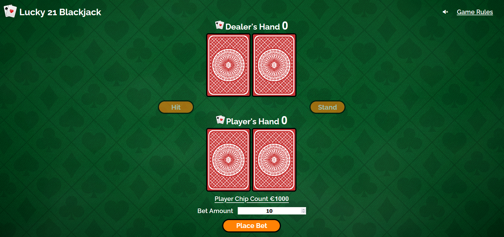
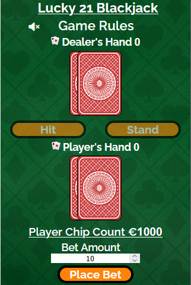
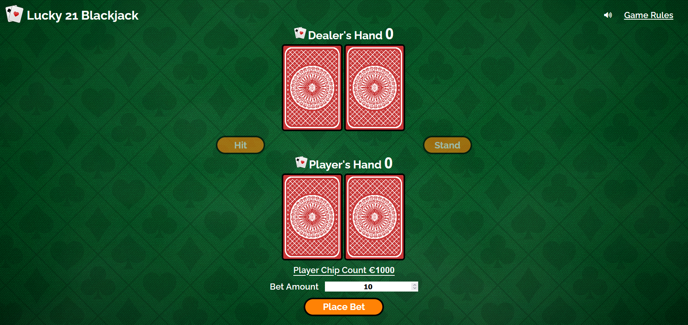
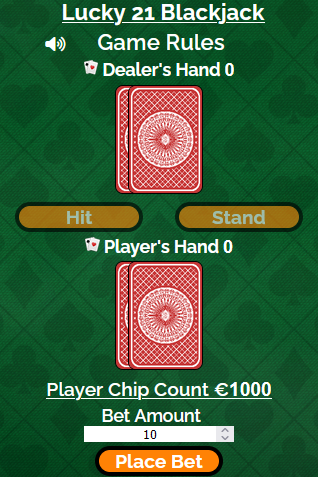
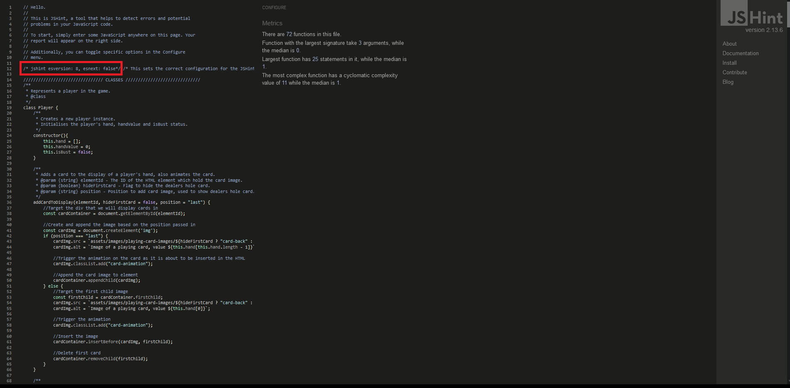
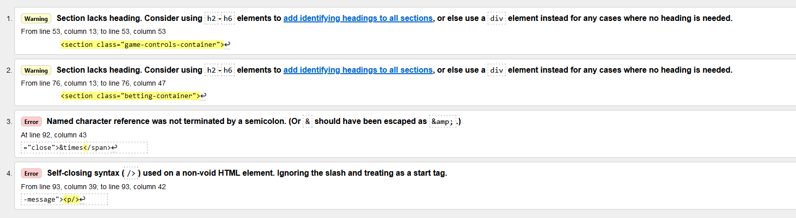
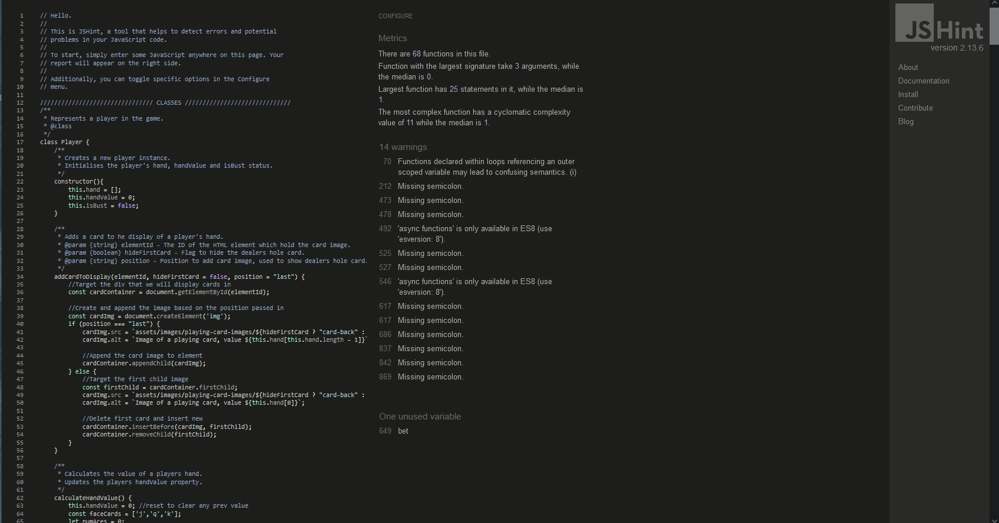

# Lucky 21 Blackjack
The Lucky 21 online game was designed to give the user a place to practice and hone their Blackjack skills. 

[Lucky 21 Blackjack Online Game](https://garydolan.github.io/ci-p2-blackjack/)

# Table of Contents
1. [Introduction](#lucky-21-blackjack)
2. [User Experience](#user-experience)
    * [Initial Discussion](#initial-discussion)
    * [User stories](#user-stories)
3. [Design](#design)
    * [Colour scheme](#colour-scheme)
    * [Typography](#typography)
    * [Imagery](#imagery)
    * [Wireframes](#wireframes)
4. [Features](#features)
    * [Common to all](#common-to-all-pages)
    * [Game page](#game-page)
    * [Header](#header)
    * [Game rules modal](#game-rules-modal)
    * [Dealer section](#dealer-section)
    * [Game controls](#game-controls)
    * [Player section](#player-section)
    * [Betting section](#betting-section)
    * [Play again button](#play-again-button)
    * [Modal pop up box](#modal-pop-up-box)
    * [Game Audio](#game-audio)
    * [Card Animation](#card-animation)
    * [404 page](#404-page)
    * [Game Mechanics](#game-mechanics)
    * [Future Implementations](#future-implementations)
    * [Accessibility](#accessibility)
5. [Technologies used](#technologies-used)
    * [Languages](#languages)
    * [Version control](#version-control)
    * [Programs](#programs)
    * [Tools](#tools)
6. [Deployment & Local Deployment](#deployment--local-deployment)
    * [Deployment](#deployment)
    * [Local Deployment](#local-deployment)
        * [How to Fork](#how-to-fork)
        * [How to Clone](#how-to-clone)
7. [Testing](#testing)
    * [Automated testing](#automated-testing)
    * [Manual testing](#manual-testing)
    * [Lighthouse testing](#lighthouse-testing)
    * [User story testing](#user-story-testing)
    * [Bugs](#manual-testing-bugs)
8. [Credits](#credits)
    * [Copy](#copy)
    * [Imagery](#images)
    * [Audio](#audio)
    * [Code](#code)
    * [Acknowledgements](#acknowledgements)

# User Experience

## Initial Discussion
Lucky 21 Blackjack is an online game that I (Gary Dolan) developed for my second project as part of Code Institutes Diploma in Full Stack Software Development. The online games target audience is people interested in learning to play blackjack, people looking to practice to improve their blackjack skills and people looking to just play blackjack for fun. The online game will provide the user with an easy to use intuitive game interface that has simple controls. The online game will also allow the user to simulate betting so they can become accustom to how betting  in a real blackjack game works. 

## User stories

### Owner / Client goals
* To ensure the user can easily and intuitively use the online game.
* To create an online game that encourages first time learning, keeping consistent colouring and imagery across all game features.
* To create an online game that encourages the user to relax, have fun and enjoy themselves, using colouring, imagery and light hearted and informal text.
* To provide the user with all the information needed to play the game, ensuring that all players, regardless of skill level can enjoy the game.
* To create an online game that encourages users to visit often and enjoy playing. 
* To ensure that the user regardless of their actions cannot cause any issues with the game.
* To create an online game which is playable on a large array of devices. 
* To create a high level of user feedback while playing the online game, ensuring the user knows where they can and when the have interacted with the online game.
* To create an online game with a high level of accessibility so that all users regardless of capacity can play and enjoy it. 

### First time visitor goals
* I want to learn about blackjack and how to play.
* I want to play blackjack and practice my skills.
* I want the game to be intuitive and easy to play.
* I want the game to provide me with feedback regarding actions I can take or actions I have taken. 
* I want the ability to place bets when playing.
* I want the game to be fun.

### Returning visitor goals 
* I want to play blackjack.
* I want the game to be familiar and to remember all the functionality immediately.
* I want to be able to place bets and try win larger amounts of chips.
* I want the ability to play the online game on all my devices.
* I want the game to be fun.

[Return to Table of Contents](#table-of-contents)

# Design
## Colour scheme
The primary objective I wanted to achieve with my colour scheme was to invoke a sense of familiarity in the players. Blackjack is a well known and loved game so I wanted to choose colours that players would expect. I also wanted to choose some colours that the players would not be used to seeing, so that it would immediately draw their attention. These colours would be used for calls to action. 

A secondary goal of my colour scheme was to give the appearance of quality. I didn't just want to use solid colours but textured and high quality images where practical.

Another goal of my colour scheme was to ensure that the users we not overwhelmed or distracted by it. I used darker colours were possible, and backgrounds and images that would not distract the player. This ensures the players could relax and play the game for long periods of time if they choose to. 

Due to the darker game, backgrounds I wanted to use white text where possible to ensure there would be good contrast between them and would not distract the player. 

I based my colour palette largely around the existing colours of most versions of blackjack. I initially choose the background image and then selected colours that would complement this and also comply to WCAG standards. I also used [Coolors](https://coolors.co/) to visualise my palette. 

* #01441B: This is one of my primary colours chosen based on the background image I choose to simulate a blackjack table.
* #C83737: This is another one of my primary colours chosen for the rear of the playing cards, again a very common colour used in blackjack.
* #FFFFFF: This is one of my secondary colours intended for use in most if not all of my text content.
* #FF8205: This colour was chosen for use in my button as a strong stand out colour for calls to action.  
* #CACBD8: This colour was selected for use in elements which require user feedback such as the game rules modal, home icon and the audio controls. 

All intended colour combination from my pallet were tested on [Webaim](https://webaim.org/resources/contrastchecker/) to ensure any text displayed on another colour complied with WCAG AAA standards.

I had one small issue when contrasting the text and background. This was with regards to the button text. I originally planned to use a darker text colour, such as #383838 in the buttons to ensure full compliance. When I used darker colours I found that although they were visible against their immediate background, they were harder to see due to the dark colour of the game background. I spoke to my class mates and my cohort facilitator and they all agreed that a brighter coloured text gave much better visibility against the orange button and the green background image.  

## Typography
When considering fonts, I used a combination of [Google fonts](https://fonts.google.com/) to research fonts, [Font joy](https://fontjoy.com/) to compare various fonts. I decided to use a font I had used on a previous project called Raleway because it was clean and elegant and offered a wide variety of weights.

I did change this font to sans-serif in two places in my code where numbers were used as then number sat too low against the text and created a bad visual style. I used sans-serif for the player and dealer hand value number and for the player chip count number.

## Imagery
Due to the nature of blackjack I did not need to use many images in my game. 

My first image was the background image for the game. This would be an important visual aspect of the game so I wanted to ensure I choose one that was very high quality and would not be distracting. I choose to licence an [image](https://stock.adobe.com/ie/search?k=blackjack+background&asset_id=325384191) from [Adobe Stock](https://stock.adobe.com) and have included an image for proof of licensing. 

My next [images](https://opengameart.org/content/playing-cards-vector-png) were for the playing card faces, there are 52 in total and I downloaded them under public domain license from [OpenGameArt.Org](https://opengameart.org).

The final two images I used were from [Pixabay](https://pixabay.com/). The first [image](https://pixabay.com/vectors/card-card-game-playing-card-game-7031432/) was used for the back of my playing cards and the second [image](https://pixabay.com/vectors/cards-poker-game-heart-spade-icon-98382/) was used as an icon in my logo and in two other places in the game. This image was converted to an icon using [Favicons convertor](https://favicon.io/favicon-converter/).

## Wireframes
All the wireframes for the online game were created using the Balsamic desktop application. They were also created for specific viewports, which I took from [am I responsive](https://ui.dev/amiresponsive). 

Desktops - 1600 x 992px

Laptops - 1280 x 802px

Tablet - 768 x 1024px

Mobile - 320 x 480px 

There were some deviations from the above wireframes as the game was developed, including the removal of the message display section, which was replaced by modal pop ups.

[Return to Table of Contents](#table-of-contents)

# Features
The online game contains 2 pages in total. There is one game page and a 404 page. The online game is fully responsive and will work on a range of devices. 

## Common to all pages

### Logo
The logo is common on both pages of the online game. The logo consists of an icon and matching text and is a link to return to the game page. The logo also provides feedback to the user, changing colour when the user mouses over it. 

### Background
The background image is a high quality textured image that is used on both game pages for consistency.   

## Game page
The game page is the page that contains the game, all of its functionality and interactivity. It consists of a background image (discussed above) which covers the entire page, a header containing a logo, audio controls and a game rules pop up, a dealer section containing the dealer's information and cards, a game controls section containing the hit and stand buttons, a player section containing the player's information, cards and chip count and finally a betting section which contains the betting input and the place bet button. 

The game page can also contain a play again button if the player runs out of chips and can no longer continue their game. This button is displayed in place of the betting section. 

At times the game page may also contain a pop up window. The window messages will change based on the information that needs to be displayed and will scale based on the device size.

## Header
The header of the online game consists of a logo, audio controls and game rules text. The logo consist of an icon and matching text and is a link to return to the game page. The logo also provides feedback to the user, changing colour when the user mouses over it. The audio controls are in the form of a speaker icon. This icon will toggle the audio from on to off or vice versa when pressed. The audio icon also provides feedback to the user, changing colour when moused over and changing from an off speaker icon to an on speaker icon when pressed. The game rules text is clickable and when clicked it will display a game rules modal. The game rules text also provides feedback in the form of a colour change when the user mouses over it. 

## Game rules modal
The games rule modal can be accessed by clicking game rules in the header. Once clicked a pop up modal will appear and display the game rules to the user. The popup will contain an x and an OK button, either of these can be pressed to close the modal. The modal will also place a slightly opaque image over the game in places not occupied by the modal message. The game is not playable and has no interactivity when the game rules modal is displayed. At mobile sizes the modal will adapt and allow scrolling so that the rules can be read fully.

## Dealer section
The dealer section of the online game contains the dealer's information and the dealer's cards. The dealer's information consists of an icon followed by the dealer's hand text and finally a number representing the dealer's hand value. At the beginning of the game the dealers hand value will be zero and their cards will be face down. The card images in the dealer's section will overlap more and more as the page size decreases. 

As the game progresses and the dealer deals the card's the dealer will show one card and keep one card face down, the value of the dealers hand will also be displayed without the value of the face down card.

Once the game reaches the point where the player finished playing, the dealer's hand is revealed and the value of all the dealers cards will be displayed. At this point the dealer may take more cards, these will be added next to the existing cards in their hand. 

## Game controls
The game controls section consists of a hit and a stand button. These buttons are used by the player to make decisions about how they would like to play the game. Initially these buttons will be dulled down in colour and their functionality will be disabled. At this point the user will not be able to interact with them. 

Once the player places a bet and the cards are dealt these buttons will be made available and return to their normal colour. Once available the buttons will provide feedback (colour change) to the user when moused over. 

When the hit button is pressed the dealer will deal another card to the player,this will be added to the players hand and their total hand value will be updated. The user can choose to hit once their hand value does not exceed 21. 

When the player presses the stand button it will signal that they do not wish to be dealt any more cards. At this point the hit and stand buttons will be disabled again and the game will continue.   

## Player section
The player section of the online game contains the player's information, the player's cards and the players chip count. The player's information consists of an icon followed by the player's hand text and finally a number representing the player's hand value. At the beginning of the game the player's hand value will be zero, their cards will be face down and their chip count will be set to 1000. The card images in the player's section will overlap more and more as the page size decreases. 

Once the player places a bet their chip count will be update and the dealer will deal the cards. The player will be dealt two cards face up and their hand value will be updated. 

If the player uses the hit button cards will be added to their hand and displayed alongside their current cards, the hand count is also updated each time they receive a card. The player chip count will also be updated when the player wins a game. 

## Betting section
The betting section of the game consists of a betting input and a place bet button. 

When the games starts the player's focus will be drawn to the bet amount input. This input allows the player to enter an amount they wish to bet on the upcoming game. The amount they enter will be placed as a bet and cards will be dealt once they press enter or click the place bet button. The input will only accept bets in increments of 10, from 10 to the players chip count. If the player enters anything other than this a modal will be displayed informing them that their bet is invalid. If a player enters a valid bet amount that is larger than there chip count, the game will automatically reduce their bet to their max chip count and inform them of this via a modal pop up.

## Play again button 
The play again button is only shown when a player's game has ended due to their chip count being too low to place a bet. The play again button will replace the betting input section and the player chip count. As the name suggests when the button is clicked a new game will start. Like all other buttons this one provides feedback via colour changes.

## Modal pop up box
The game will provide the player with valuable information throughout the course of the game in the form of a pop up modal. This modal will have the same style regardless of the message but will scale to the message size. Below is a list of all the modal messages that can be displayed in the game.

### Game rules modal
This modal has already been discussed [above](#game-rules-modal). 

### Win
This modal is displayed when the player wins. A win occurs when the players hand value is closer to 21 than the dealer and neither they nor the dealer bust (go above 21).

### Lose
This modal is displayed when the player loses. A loss occurs when the player is further away from 21 than the dealer and neither they nor the dealer bust (go above 21).

### Bust
This modal is displayed when the player busts. A player is considered bust when their hand value exceeds 21.

### Blackjack
This modal is displayed when the player achieves blackjack. Blackjack occurs when a players hand count totals 21 with only the first two cards.

### Push
This modal is displayed when there is a push. A push occurs when they player and dealer's hand count match at the end of a game.

### Dealer bust
This modal is displayed when the dealer busts. A dealer is considered bust when their hand value exceeds 21. 

### No chips
This modal is displayed when the player runs out of chips due to losing games.

### Invalid bet
This modal is displayed when a player enters an invalid input into the betting input and places the bet (presses enter or clicks the place bet button). A valid bet is a number above 0 in increments of 10. Anything besides this will trigger this modal, for example, abc, ==-, 101 etc.

### Bet exceeds chip count
This modal is displayed when the player places a valid betting amount that exceeds their chip count in the betting input and places the bet. 

## Game audio
One of my final additions to the game was the game audio. I did this, not only to add another element of feedback, but to add some fun and atmosphere. I added four types of audios to the game,
* Background music - This is a traditional swing/jazz piece of music, that when played will loop. I did not want this to distract from the game, overwhelm the player or cover the other sounds in the game so the volume has been set to 10%.
* Card flip sound - This was added to indicate when a card is being dealt or turned over. It was left at a default of 100% volume as I felt it was one of the most important sounds in the game and the audio clips volume was quite low.
* Win sound - This sound was added to indicate to the player they had won. It is light and exciting and adds to a great user experience. This was added at a volume of 20%.
* Loss sound - This sound was added to indicate that the player has lost. Again, to promote a good user experience I wanted to use a fun playful sound to ensure even when losing the player is having fun. I choose the "wha wha" trombone sound and set its volume at 20%.

All the audio in the game is off by default to ensure a good user experience. A speaker icon was added to the header of the game, which allows the user to toggle the audio on and off. When the audio is toggled on and off the icon will change to provide feedback and indicate the audio status.

### Audio disabled
#### Desktop

#### Mobile

### Audio enabled 
#### Desktop

#### Mobile

### Game audio demo 
Please click the link below to be directed to the demo video of the game audio. This opens a youtube video. 

## Card Animation
The last feature I added to my code was a card animation. The animation occurs anytime the dealer deals a card to the player or themselves and also when the dealer shows their hole card. Its primary purpose was to add a feel of quality to the online game and improve the users experience. 

The animation is added to the card image inside the function which creates and adds the cards to the HTML. Due to this the card variable no longer exists after it is inserted into the HTML and the function ends, meaning it does not need to hold any of its values after the animation using fill mode forward etc.

### Link to video of animation 
Please click the link below to be directed to the demo video of the animation. This opens a youtube video.

## 404 page
The 404 page is the page the user will be directed to if they try to visit a page that doesn't exist. It is used as feedback to let the user know that something has gone wrong and provide them with a home button back to safety (game page).

## Game Mechanics 
Below is a summary of the game functionality broken down into sections.

### Game startup
Once the page has loaded the game will begin initialisation and start up. At this point the dealer and player's card will be face down, the hit and stand buttons will be disabled and the users focus will be placed on the betting input. 

### Placing a bet
Once the player has the minimum amount needed (10) to place a bet they can play the game, if not they will be given the option to play again via an onscreen button. If play again button is pressed a new game will be started and the players chip count will be set to 1000. The player can then enter their bet into the betting input field and press the place bet button (or press enter). 

If the bet is invalid the user will receive a message indicating this and they can then try to enter a valid bet again. A valid bet is a number from 10 up in increments of 10. If for any reason the user places a valid bet that is larger than their chip count the bet amount will be reduced to the players chip count and placed (the user will be informed of this). 

### Player play
Once a bet amount has been entered into the betting input and placed (press place bet button or enter) the place bet button will be disabled. Cards will then be dealt to both the dealer and the player one by one with one second gaps between cards, the dealers first card will remain hidden.

Once the dealer and player have been dealt two cards each, the hand values will be updated and the hit and stand buttons will be enabled. The player then has two options hit or stand. 

If the player chooses the hit button the dealer will deal them another card and their hand value will be update. The player can continue to hit until they bust (hand value > 21) at which point all user interactivity will be disabled, the player will be notified they bust and a new game will start 3 seconds later.  

The player can choose the stand option once they no longer want to be dealt any more cards. This will end the players play and disable the hit and stand buttons.

### Dealer play 
Once the player stands the dealer play commences. The dealer will reveal their hole (hidden) card and their hand value will be updated to include this cards value. 

If the dealers hand value is 17 they will stand and the game results will be evaluated.

If the dealers hand is below 17 they must draw cards until their hand value is 17 or above.

If while drawing cards the dealer's hand value becomes greater than 21 they will bust and the game results will be evaluated.

### Game results
Once the dealer busts or stands the game results will be evaluated to find the winner. 
* If the dealers hand value was greater than 21 they will bust and the player will win.
* If the player and dealer's hand values match it is considered a draw (push).
* If the players hand value is higher than the dealer's at this point the player wins.
* If the players hand value is lower than the dealer's at this point the player loses. 

### Display results and collect winnings
Based upon the game results above the game will now display a message informing the player of the results. At this point if the player has won, their chip count will update to include their winnings. Player winnings are based on how the player won,
* Standard win 1:1 odds, player receives double the amount they bet.
* Push (draw) player received their bet back.
* Blackjack win 3:2 odds, player receives 2.5 times the amount they bet.

3 seconds after this a new game is started. 

### Note:
During gameplay, if at any time the cards in the dealer's deck drop below 20, the dealer will create and shuffle a new deck which will be user from then on. This is background functionality hidden from the user.

## Future implementations
In the future I would like to add the following features to the online game,
* Functionality for splitting a players hand.
* Update the betting section so that it used images of chips for betting.
* Add an option for the user to select the number of deck that are used in the game
* Add local storage so that the player's game progress (chip count) could be saved.
* Add a player scoring system that would show player's largest chip counts.
* Update functionality so that upon player getting blackjack the dealers cards are checked for blackjack before the player wins.
* Add a multiplayer mode to have more than one player. The game codebase was written using an object-oriented approach to allow for this. New players can be created and will all have the same properties and methods. 

## Accessibility
I was conscious of accessibility throughout the entire game development process and took the following steps to ensure that the game would be as accessible as possible.

* Used as much semantic HTML as possible, where relevant.
* Choose the game colours carefully ensuring I used colours that were compliant to the highest standards and provided excellent contrast.
* Used alt attributes and aria labels where applicable.
* Used titles where applicable to give the user hints as to what the elements around the page mean and what functions they have.
* Used placeholder text on input to ensure user knew what the purpose of the input was.  

[Return to Table of Contents](#table-of-contents)

# Technologies used
## Languages
* HTML - Used to add the game content and structure.
* CSS - Used to style the game content.
* Javascript - Used to control the games logic, handle user interactions.

## Version control
* Git commands - Used via windows powershell (using Posh-Git module) 
* Github.com. - Repository created using code institute student template 
* Github desktop - Used as a local visual aid between pushing to master. It offers a clean view of all code changes since last commit, commit history etc.

## Programs
* Microsoft Visual Studio Code 
* Notepad ++
* Balsamiq desktop for creation of wireframes

## Tools
* [Coolors](https://coolors.co/) was used to visualise colour palettes.
* [Google chrome eyedropper extension ](https://eyedropper.org/) was used to get hex code colour of background image for colour selection and validation.
* [Webaim](https://webaim.org/resources/contrastchecker/) was used to ensure colour palette is compliant. 
* [Google fonts](https://fonts.google.com/) was used to research and import fonts.
* [Font joy](https://fontjoy.com/) was used to compare various fonts.
* [Font awesome](https://fontawesome.com/) was used to import font icons.
* [Chat GPT](https://openai.com/blog/chatgpt) was used for game rules copy.
* [Pixabay](https://pixabay.com) was used as a source for images and audio used in the game.
* [Adobe Stock](https://stock.adobe.com/ie) was used for a background image.
* [Open Game Art](https://opengameart.org) was used as a source for card images.
* [Favicon convertor](https://favicon.io/favicon-converter/) used to make an icon from an image.
* [Birme](https://www.birme.net) was used to change image formats and resize images.
* [Google](https://www.google.ie/), [Youtube](https://www.youtube.com/) and [wW3schools](https://www.w3schools.com) were used throughout the games development to help solve issues when stuck etc. Youtube was also used to host video clips for this readme.
* [Google Lighthouse](https://developer.chrome.com/docs/lighthouse/overview/) used to test the games performance, accessibility etc.
* [W3C CSS validator](https://jigsaw.w3.org/css-validator/) used to validate the CSS
* [W3C HTML validator](https://validator.w3.org/nu/) used to validate the HTML
* Google and firefox build in dev tools user to test and examine code.
* Used this test editor from [W3schools](https://www.w3schools.com/css/tryit.asp?filename=trycss3_animation1) to test animation types and properties.

[Return to Table of Contents](#table-of-contents)

# Deployment & Local Deployment
## Deployment
Github pages was used to deploy this online game. To deploy a website using github pages, do the following,

1. Log into or signup at [Github](https://github.com).
2. Find the correct repository and select it.
3. Select the settings icon from the menu bar.
4. Select the pages option from the left hand menu.
5. In the source dropdown box select main.
6. Click the save button.
7. The website is now deployed using github pages and when ready (can take a minute) a link will appear at the top of the page for your website. 

## Local Deployment
### How to Fork
To fork this repository,
1. Log into or signup at [Github](https://github.com).
2. Select the repository for this online game.
3. Click the fork button (upper right).
### How to Clone
To clone this repository,
1. Log into or signup at [Github](https://github.com).
2. Select the repository for this online game
3. Click the green code button (upper right).
4. Copy the URL using the copy button. 
5. Open the terminal in your editor (or of your choosing) and move to the directory which you want to clone to.
6. Type git clone and paste the repository link, then press enter.

[Return to Table of Contents](#table-of-contents)

# Testing
Testing of this online game was ongoing throughout the development process. I used the developer tools in chrome and firefox to test all aspect of the site including its responsiveness.  
## Automated testing
The automated testing of this online games HTML code was carried out using [Validator w3](https://validator.w3.org/nu/), all html pages passed without any errors or warnings, the results are shown below 

* [index.html test results](https://validator.w3.org/nu/?doc=https%3A%2F%2Fgarydolan.github.io%2Fci-p2-blackjack%2F)  
* [404.html test results](https://validator.w3.org/nu/?doc=https%3A%2F%2Fgarydolan.github.io%2Fci-p2-blackjack%2F404.html)

The online games CSS was validated using [W3C CSS validator](https://jigsaw.w3.org/css-validator/). The game passed with no errors or warnings and the test results can be seen below.
* [CSS test results](https://jigsaw.w3.org/css-validator/validator?uri=https%3A%2F%2Fgarydolan.github.io%2Fci-p2-blackjack%2F&profile=css3svg&usermedium=all&warning=1&vextwarning=&lang=en).

The online games JavaScript was validated using the [JSHint tool](https://jshint.com/). The game passed with no errors and the test results can be seen below. 

Initially the online tool gave warnings regarding my use of async functions as they are a feature only available in ES8. Due to the fact that the tool does not currently have the option to set it to include ES8 functionality, I needed to figure out how to do this myself. To do this I used the [options reference](https://jshint.com/docs/options/#esversion) for the tool and set my version to ES8. This then gave a warning stating that there would be a conflict if I configure the tool with ES8 and also leave the ESnext option on. I added a part to the comment to disable ESnext. This allows the tool to scan my code including scanning features availble in ES8. I have left the comment in my code (as advised by student support, who I spoke to after I solved the issue) so that if my code is copied and pasted into the validator it will apply the correct settings to the tool.

## Manual testing
The tests for this online game listed below were conducted on a number of browsers (google chrome, mozilla firefox, microsoft edge, samsung internet) across various devices (msi laptop with large screen attached, surface pro, Huawei P30 Pro). I also tested the games responsive design using the developer tools on chrome and firefox to ensure it responded as intended.

Game page tests 1st game

| Test                                          | Expected Result                                                                                           | Pass   |
|-----------------------------------------------|-----------------------------------------------------------------------------------------------------------|--------|
|Logo - feedback                                |Changes colour when moused over                                                                            |&#10004;|
|Logo - functionality                           |Sends user to home page when clicked                                                                       |&#10004;|
|Game rules modal - feedback                    |Changes colour when moused over                                                                            |&#10004;|
|Game rules modal - display                     |Modal displays when clicked                                                                                |&#10004;|
|Game rules modal - text                        |Modal displays game rules text                                                                             |&#10004;|
|Game rules modal - x button                    |Closes modal window                                                                                        |&#10004;|
|Game rules modal - OK button                   |Closes modal window                                                                                        |&#10004;|
|1st game start - focus                         |Focus is moved to betting input on start                                                                   |&#10004;|
|1st game start - old bet cleared               |Value of player bet set to 0                                                                               |&#10004;|
|1st game start - hit button disabled           |Hit button is disabled on start                                                                            |&#10004;|
|1st game start - stand button disabled         |Stand button is disabled on start                                                                          |&#10004;|
|1st game start - max bet                       |Players max bet is set to chip count on game start                                                         |&#10004;|
|1st game start - dealer and player cards       |Cleared and replaced with card backs                                                                       |&#10004;|
|1st game start - dealer and player hand value  |Reset to 0                                                                                                 |&#10004;|
|1st game start - chip count < 10               |Modal displayed with no chips message, Play again button displayed                                         |&#10004;|
|1st game start - chip count > 10               |Betting is enable                                                                                          |&#10004;|
|1st game start - chip count display            |Chip count of 1000 displayed                                                                               |&#10004;|
|1st game start - betting input value           |Betting input defaults to min bet value of 10                                                              |&#10004;|
|1st game start - betting input entry           |User can use arrows (large displays only) to change bet                                                    |&#10004;|
|1st game start - place bet button feedback     |Changes colours when moused over                                                                           |&#10004;|
|1st game bet - place bet button functionality  |Bet is placed when button is pressed                                                                       |&#10004;|
|1st game bet - place bet button chip count     |Bet amount is removed from chip count when button is pressed                                               |&#10004;|
|1st game bet - place bet button disable        |Button is disabled after it is pressed                                                                     |&#10004;|
|1st game bet - invalid input                   |Only numbers in increments of 10 can be placed, all other entries trigger modal invalid message            |&#10004;|
|1st game bet - valid input above chip count    |Bet amount will be reduced to chip count and modal will inform user                                        |&#10004;|
|1st game player play - new deck                |If cards in deck drop below 20 a new deck is created and shuffled                                          |&#10004;|
|1st game player play - dealing                 |Cards are dealt 1 by 1 with 1 sec delay, hole card is face down                                            |&#10004;|
|1st game player play - card displays           |Card images are correctly displayed for delaer and user                                                    |&#10004;|
|1st game player play - card overlap            |Cards overlap correctly at lower screen sizes, card values are visable                                     |&#10004;|
|1st game player play - player hand count       |Once the cards have been dealt, the player's hand value is updated with the correct value                  |&#10004;|
|1st game player play - dealer hand count       |Once the cards have been dealt, the dealer's hand value shows the correct value (excludes hole cards value)|&#10004;|
|1st game player play - hit button enabled      |After cards are dealt hit button is enabled                                                                |&#10004;|
|1st game player play - stand button enabled    |After cards are dealt hit button is enabled                                                                |&#10004;|
|1st game player play - hit button feedback     |Changes colour on mouse over                                                                               |&#10004;|
|1st game player play - stand button feedback   |Changes colour on mouse over                                                                               |&#10004;|
|1st game player play - blackjack               |After cards dealt, players hand value is 21 win modal shown, chip count updated, new game starts in 3 sec. |&#10004;|
|1st game player play - hit button functionality|When pressed the player will receive another card, hand value is updated                                   |&#10004;|
|1st game player play - hit btn functionality 2 |After 3rd card, if not bust player can take another                                                        |&#10004;|
|1st game player play - hit btn functionality 3 |After 4th card, if not bust player can take another                                                        |&#10004;|
|1st game player play - bust                    |When hit is selected if hand count goes above 21, bust modal is displayed, new game starts after 3 sec.    |&#10004;|
|1st game player play - stand btn functionality |When pressed players gameplay ends, hit and stand buttons disabled                                         |&#10004;|
|1st game dealer play - draw cards below 17     |Dealer will draw cards until they reach 17 or above                                                        |&#10004;|
|1st game dealer play - draw cards above 17     |Dealer will take no more cards, game results will be evaluated                                             |&#10004;|
|1st game game results - dealer bust            |Game ends, correct modal displayed, chip count updated, new game starts after 3 sec                        |&#10004;|
|1st game game results - push                   |Game ends, correct modal displayed, chip count updated, new game starts after 3 sec                        |&#10004;|
|1st game game results - player wins            |Game ends, correct modal displayed, chip count updated, new game starts after 3 sec                        |&#10004;|
|1st game game results - player loses           |Game ends, correct modal displayed, chip count updated, new game starts after 3 sec                        |&#10004;|
|Audio - Icon default image                     |Defaults to speaker off icon                                                                               |&#10004;|
|Audio - Icon default feedback                  |Change colour on mouse over                                                                                |&#10004;|
|Audio - Icon default functionality             |When clicked, music plays, icon changes to on icon                                                         |&#10004;|
|Audio - Icon toggle                            |When clicked, music and icon toggle from on to off and vice versa                                          |&#10004;|
|Audio - Icon blocks all audio                  |When toggled off, no other audio sounds (card flip, win, lose) will play                                   |&#10004;|
|Audio - Card flip sound                        |Ensure card flip sound is played when cards are dealt, player hits or dealer turns hole card               |&#10004;|
|Audio - Win sound                              |Ensure win sound is played for all types of win (win, blackjack, push, dealer bust)                        |&#10004;|
|Audio - Lose sound                             |Ensure lose sound is played for all types of loss (lose, bust)                                             |&#10004;|
|Animation - Card filp (deal)                   |Ensure card animation works for initial deal                                                               |&#10004;|
|Animation - Card filp (hit)                    |Ensure card animation works when player hits                                                               |&#10004;|
|Animation - Card filp (dealer hole card)       |Ensure card animation works when dealer reveals hole card                                                  |&#10004;|
|Animation - Card filp (dealer hits)            |Ensure card animation works when dealer takes additional cards                                             |&#10004;|

Game page tests 2nd game

| Test                                          | Expected Result                                                                                           | Pass   |
|-----------------------------------------------|-----------------------------------------------------------------------------------------------------------|--------|
|2nd game start - focus                         |Focus is moved to betting input on start                                                                   |&#10004;|
|2nd game start - old bet cleared               |Value of player bet set to 0                                                                               |&#10004;|
|2nd game start - hit button disabled           |Hit button is disabled on start                                                                            |&#10004;|
|2nd game start - stand button disabled         |Stand button is disabled on start                                                                          |&#10004;|
|2nd game start - max bet                       |Players max bet is set to chip count on game start                                                         |&#10004;|
|2nd game start - dealer and player cards       |Cleared and replaced with card backs                                                                       |&#10004;|
|2nd game start - dealer and player hand value  |Reset to 0                                                                                                 |&#10004;|
|2nd game start - chip count < 10               |Modal displayed with no chips message, Play again button displayed                                         |&#10004;|
|2nd game start - chip count > 10               |Betting is enable                                                                                          |&#10004;|
|2nd game start - chip count display            |Chip count of 1000 displayed                                                                               |&#10004;|
|2nd game start - betting input value           |Betting input defaults to min bet value of 10                                                              |&#10004;|
|2nd game start - betting input entry           |User can use arrows (large displays only) to change bet                                                    |&#10004;|
|2nd game start - place bet button feedback     |Changes colours when moused over                                                                           |&#10004;|
|2nd game bet - place bet button functionality  |Bet is placed when button is pressed                                                                       |&#10004;|
|2nd game bet - place bet button chip count     |Bet amount is removed from chip count when button is pressed                                               |&#10004;|
|2nd game bet - place bet button disable        |Button is disabled after it is pressed                                                                     |&#10004;|
|2nd game bet - invalid input                   |Only numbers in increments of 10 can be placed, all other entries trigger modal invalid message            |&#10004;|
|2nd game bet - valid input above chip count    |Bet amount will be reduced to chip count and modal will inform user                                        |&#10004;|
|2nd game player play - new deck                |If cards in deck drop below 20 a new deck is created and shuffled                                          |&#10004;|
|2nd game player play - dealing                 |Cards are dealt 1 by 1 with 1 sec delay, hole card is face down                                            |&#10004;|
|2nd game player play - card displays           |Card images are correctly displayed for delaer and user                                                    |&#10004;|
|2nd game player play - card overlap            |Cards overlap correctly at lower screen sizes, card values are visable                                     |&#10004;|
|2nd game player play - player hand count       |Once the cards have been dealt, the player's hand value is updated with the correct value                  |&#10004;|
|2nd game player play - dealer hand count       |Once the cards have been dealt, the dealer's hand value shows the correct value (excludes hole cards value)|&#10004;|
|2nd game player play - hit button enabled      |After cards are dealt hit button is enabled                                                                |&#10004;|
|2nd game player play - stand button enabled    |After cards are dealt hit button is enabled                                                                |&#10004;|
|2nd game player play - hit button feedback     |Changes colour on mouse over                                                                               |&#10004;|
|2nd game player play - stand button feedback   |Changes colour on mouse over                                                                               |&#10004;|
|2nd game player play - blackjack               |After cards dealt, players hand value is 21 win modal shown, chip count updated, new game starts in 3 sec. |&#10004;|
|2nd game player play - hit button functionality|When pressed the player will receive another card, hand value is updated                                   |&#10004;|
|2nd game player play - hit btn functionality 2 |After 3rd card, if not bust player can take another                                                        |&#10004;|
|2nd game player play - hit btn functionality 3 |After 4th card, if not bust player can take another                                                        |&#10004;|
|2nd game player play - bust                    |When hit is selected if hand count goes above 21, bust modal is displayed, new game starts after 3 sec.     |&#10004;|
|2nd game player play - stand btn functionality |When pressed players gameplay ends, hit and stand buttons disabled                                         |&#10004;|
|2nd game dealer play - draw cards below 17     |Dealer will draw cards until they reach 17 or above                                                        |&#10004;|
|2nd game dealer play - draw cards above 17     |Dealer will take no more cards, game results will be evaluated                                             |&#10004;|
|2nd game game results - dealer bust            |Game ends, correct modal displayed, chip count updated, new game starts after 3 sec                        |&#10004;|
|2nd game game results - push                   |Game ends, correct modal displayed, chip count updated, new game starts after 3 sec                        |&#10004;|
|2nd game game results - player wins            |Game ends, correct modal displayed, chip count updated, new game starts after 3 sec                        |&#10004;|
|2nd game game results - player loses           |Game ends, correct modal displayed, chip count updated, new game starts after 3 sec                        |&#10004;|
|Audio - Icon default image                     |Defaults to speaker off icon                                                                               |&#10004;|
|Audio - Icon default feedback                  |Change colour on mouse over                                                                                |&#10004;|
|Audio - Icon default functionality             |When clicked, music plays, icon changes to on icon                                                         |&#10004;|
|Audio - Icon toggle                            |When clicked, music and icon toggle from on to off and vice versa                                          |&#10004;|
|Audio - Icon blocks all audio                  |When toggled off, no other audio sounds (card flip, win, lose) will play                                   |&#10004;|
|Audio - Card flip sound                        |Ensure card flip sound is played when cards are dealt, player hits or dealer turns hole card               |&#10004;|
|Audio - Win sound                              |Ensure win sound is played for all types of win (win, blackjack, push, dealer bust)                        |&#10004;|
|Audio - Lose sound                             |Ensure lose sound is played for all types of loss (lose, bust)                                             |&#10004;|
|Animation - Card filp (deal)                   |Ensure card animation works for initial deal                                                               |&#10004;|
|Animation - Card filp (hit)                    |Ensure card animation works when player hits                                                               |&#10004;|
|Animation - Card filp (dealer hole card)       |Ensure card animation works when dealer reveals hole card                                                  |&#10004;|
|Animation - Card filp (dealer hits)            |Ensure card animation works when dealer takes additional cards                                             |&#10004;|

Game page tests nth game

| Test                                          | Expected Result                                                                                           | Pass   |
|-----------------------------------------------|-----------------------------------------------------------------------------------------------------------|--------|
|nth game start - focus                         |Focus is moved to betting input on start                                                                   |&#10004;|
|nth game start - old bet cleared               |Value of player bet set to 0                                                                               |&#10004;|
|nth game start - hit button disabled           |Hit button is disabled on start                                                                            |&#10004;|
|nth game start - stand button disabled         |Stand button is disabled on start                                                                          |&#10004;|
|nth game start - max bet                       |Players max bet is set to chip count on game start                                                         |&#10004;|
|nth game start - dealer and player cards       |Cleared and replaced with card backs                                                                       |&#10004;|
|nth game start - dealer and player hand value  |Reset to 0                                                                                                 |&#10004;|
|nth game start - chip count < 10               |Modal displayed with no chips message, Play again button displayed                                         |&#10004;|
|nth game start - chip count > 10               |Betting is enable                                                                                          |&#10004;|
|nth game start - chip count display            |Chip count of 1000 displayed                                                                               |&#10004;|
|nth game start - betting input value           |Betting input defaults to min bet value of 10                                                              |&#10004;|
|nth game start - betting input entry           |User can use arrows (large displays only) to change bet                                                    |&#10004;|
|nth game start - place bet button feedback     |Changes colours when moused over                                                                           |&#10004;|
|nth game bet - place bet button functionality  |Bet is placed when button is pressed                                                                       |&#10004;|
|nth game bet - place bet button chip count     |Bet amount is removed from chip count when button is pressed                                               |&#10004;|
|nth game bet - place bet button disable        |Button is disabled after it is pressed                                                                     |&#10004;|
|nth game bet - invalid input                   |Only numbers in increments of 10 can be placed, all other entries trigger modal invalid message            |&#10004;|
|nth game bet - valid input above chip count    |Bet amount will be reduced to chip count and modal will inform user                                        |&#10004;|
|nth game player play - new deck                |If cards in deck drop below 20 a new deck is created and shuffled                                          |&#10004;|
|nth game player play - dealing                 |Cards are dealt 1 by 1 with 1 sec delay, hole card is face down                                            |&#10004;|
|nth game player play - card displays           |Card images are correctly displayed for delaer and user                                                    |&#10004;|
|nth game player play - card overlap            |Cards overlap correctly at lower screen sizes, card values are visable                                     |&#10004;|
|nth game player play - player hand count       |Once the cards have been dealt, the player's hand value is updated with the correct value                  |&#10004;|
|nth game player play - dealer hand count       |Once the cards have been dealt, the dealer's hand value shows the correct value (excludes hole cards value)|&#10004;|
|nth game player play - hit button enabled      |After cards are dealt hit button is enabled                                                                |&#10004;|
|nth game player play - stand button enabled    |After cards are dealt hit button is enabled                                                                |&#10004;|
|nth game player play - hit button feedback     |Changes colour on mouse over                                                                               |&#10004;|
|nth game player play - stand button feedback   |Changes colour on mouse over                                                                               |&#10004;|
|nth game player play - blackjack               |After cards dealt, players hand value is 21 win modal shown, chip count updated, new game starts in 3 sec. |&#10004;|
|nth game player play - hit button functionality|When pressed the player will receive another card, hand value is updated                                   |&#10004;|
|nth game player play - hit btn functionality 2 |After 3rd card, if not bust player can take another                                                        |&#10004;|
|nth game player play - hit btn functionality 3 |After 4th card, if not bust player can take another                                                        |&#10004;|
|nth game player play - bust                    |When hit is selected if hand count goes above 21, bust modal is displayed, new game starts after 3 sec.     |&#10004;|
|nth game player play - stand btn functionality |When pressed players gameplay ends, hit and stand buttons disabled                                         |&#10004;|
|nth game dealer play - draw cards below 17     |Dealer will draw cards until they reach 17 or above                                                        |&#10004;|
|nth game dealer play - draw cards above 17     |Dealer will take no more cards, game results will be evaluated                                             |&#10004;|
|nth game game results - dealer bust            |Game ends, correct modal displayed, chip count updated, new game starts after 3 sec                        |&#10004;|
|nth game game results - push                   |Game ends, correct modal displayed, chip count updated, new game starts after 3 sec                        |&#10004;|
|nth game game results - player wins            |Game ends, correct modal displayed, chip count updated, new game starts after 3 sec                        |&#10004;|
|nth game game results - player loses           |Game ends, correct modal displayed, chip count updated, new game starts after 3 sec                        |&#10004;|
|Audio - Icon default image                     |Defaults to speaker off icon                                                                               |&#10004;|
|Audio - Icon default feedback                  |Change colour on mouse over                                                                                |&#10004;|
|Audio - Icon default functionality             |When clicked, music plays, icon changes to on icon                                                         |&#10004;|
|Audio - Icon toggle                            |When clicked, music and icon toggle from on to off and vice versa                                          |&#10004;|
|Audio - Icon blocks all audio                  |When toggled off, no other audio sounds (card flip, win, lose) will play                                   |&#10004;|
|Audio - Card flip sound                        |Ensure card flip sound is played when cards are dealt, player hits or dealer turns hole card               |&#10004;|
|Audio - Win sound                              |Ensure win sound is played for all types of win (win, blackjack, push, dealer bust)                        |&#10004;|
|Audio - Lose sound                             |Ensure lose sound is played for all types of loss (lose, bust)                                             |&#10004;|
|Animation - Card filp (deal)                   |Ensure card animation works for initial deal                                                               |&#10004;|
|Animation - Card filp (hit)                    |Ensure card animation works when player hits                                                               |&#10004;|
|Animation - Card filp (dealer hole card)       |Ensure card animation works when dealer reveals hole card                                                  |&#10004;|
|Animation - Card filp (dealer hits)            |Ensure card animation works when dealer takes additional cards                                             |&#10004;|

Game page responsive design

| Test                                          | Expected Result                                                                                           | Pass   |
|-----------------------------------------------|-----------------------------------------------------------------------------------------------------------|--------|
|Game page media query width - 1600px           |All media query rules are applied                                                                          |&#10004;|
|Game modals - 1600px                           |All game modals display correctly                                                                          |&#10004;|
|Game functionality - 1600px                    |Game functions correctly                                                                                   |&#10004;|
|Game page media query width - 1200px           |All media query rules are applied                                                                          |&#10004;|
|Game modals - 1200px                           |All game modals display correctly                                                                          |&#10004;|
|Game functionality - 1200px                    |Game functions correctly                                                                                   |&#10004;|
|Game page media query width - 992px            |All media query rules are applied                                                                          |&#10004;|
|Game modals - 992px                            |All game modals display correctly                                                                          |&#10004;|
|Game functionality - 992px                     |Game functions correctly                                                                                   |&#10004;|
|Game page media query width - 700px            |All media query rules are applied                                                                          |&#10004;|
|Game modals - 700px                            |All game modals display correctly                                                                          |&#10004;|
|Game functionality - 700px                     |Game functions correctly                                                                                   |&#10004;|
|Game page media query width - 600px            |All media query rules are applied                                                                          |&#10004;|
|Game modals - 600px                            |All game modals display correctly                                                                          |&#10004;|
|Game functionality -  600px                    |Game functions correctly                                                                                   |&#10004;|
|Game page media query width - 400px            |All media query rules are applied                                                                          |&#10004;|
|Play again button displayed  width - 400px     |All media query rules are applied                                                                          |&#10004;|
|Game modals - 400px                            |All game modals display correctly                                                                          |&#10004;|
|Game functionality - 400px                     |Game functions correctly                                                                                   |&#10004;|
|Game page media query height - 890px           |All media query rules are applied                                                                          |&#10004;|
|Game modals - 890px                            |All game modals display correctly                                                                          |&#10004;|
|Game functionality - 890px                     |Game functions correctly                                                                                   |&#10004;|
|Game page media query height - 825px           |All media query rules are applied                                                                          |&#10004;|
|Game modals - 825px                            |All game modals display correctly                                                                          |&#10004;|
|Game functionality - 825px                     |Game functions correctly                                                                                   |&#10004;|
|Game page media query height - 785px           |All media query rules are applied                                                                          |&#10004;|
|Game modals - 785px                            |All game modals display correctly                                                                          |&#10004;|
|Game functionality - 785px                     |Game functions correctly                                                                                   |&#10004;|
|Play again button displayed  width - 710px     |All media query rules are applied                                                                          |&#10004;|
|Game page media query height - 702px           |All media query rules are applied                                                                          |&#10004;|
|Play again button displayed  height - 702px    |All media query rules are applied                                                                          |&#10004;|
|Game modals - 702px                            |All game modals display correctly                                                                          |&#10004;|
|Game functionality - 702px                     |Game functions correctly                                                                                   |&#10004;|
|Game page media query height - 643px           |All media query rules are applied                                                                          |&#10004;|
|Game modals - 643px                            |All game modals display correctly                                                                          |&#10004;|
|Game functionality - 643px                     |Game functions correctly                                                                                   |&#10004;|
|Game page media query height - 534px           |All media query rules are applied                                                                          |&#10004;|
|Game modals - 534px                            |All game modals display correctly                                                                          |&#10004;|
|Game functionality - 534px                     |Game functions correctly                                                                                   |&#10004;|
|Game page media query height - 472px           |All media query rules are applied                                                                          |&#10004;|
|Game modals - 472px                            |All game modals display correctly                                                                          |&#10004;|
|Game functionality - 472px                     |Game functions correctly                                                                                   |&#10004;|

404 page tests

| Test                                  | Expected Result                       | Pass   |
|---------------------------------------|---------------------------------------|--------|
|Logo works correctly                   |Sends user to home page                |&#10004;|
|Logo feedback works correctly          |Changes colour when moused over        |&#10004;|
|Responsive design width(1600px-320px)  |Page adjusted so all item are viewable |&#10004;|
|Home button functionality              |User sent to home page                 |&#10004;|
|Page displayed for incorrect URL       |404 page is displayed                  |&#10004;|

## Lighthouse testing
The google lighthouse chrome developer tool was used to test the games performance, accessibility, best practices and Search engine optimisation. For all tests on all pages (both desktop and mobile) the online game scored very well. all results can be seen below 

404 

### Desktop

### Mobile

Index

### Desktop

### Mobile

## User story testing
### Owner / 

* I want to test that it is immediately clear to any user that is aware of blackjack that this is a blackjack game.
    * The online game imagery, colouring, background and text all make it immediately clear that this is a blackjack game.

* I want to test if the user can easily and intuitively use the online game.
    * The user is immediately focused to the betting input upon game load, only the betting input and place bet button are available to them initially. After that the user receives a lot of feedback regarding what they can interact with via button enabling / disabling, tool tips, modals etc. Interactivity was kept simple and self explanatory.

* I want to test that the games performance is good, with regards to responsiveness and load times.
    * The online game performance testing has been excellent.

* I want to test that the online game accessibility is good.
    * The online games accessibility was nearly 100% in all tests on all pages.

* I want to test that the game is viewable on a wide array of devices.
    * The game was tested on various devices and at all sizes using google dev tools, all scaled and operated correctly.

* I want to test the online game provides feedback to the user regarding items that can be interacted with.

    * All items which can be interacted with in the game supply the user with feedback in terms of colour changes, prompts, modal messaging etc.

* I want to test that the user is provided with all the information needed to play the game, ensuring that all players, regardless of skill level can enjoy the game.
    * The game rules modal in header displays the rules in full. Player's are also provided with a high level of feedback as they play.

* I want to test that regardless of the users actions, they cannot cause any issues with the game.
    * The game was heavily tested at all stages of development to ensure 100% correct functionality. Game also has strong user input validation and limits player access to controls until they are meant to be used.

* I want to test that the online game that encourages the user to relax, have fun and enjoy themselves, using colouring, imagery and light hearted and informal text.
    * Game messaing reinforces that the object of the game is to have fun (game rules modal). Jazz/swing background music is relaxing. Audio clips for win and loss also reinforces the idea of having fun.

* I want to ensure if anything goes wrong the user can navigate back to the home page.

    * There is a 404 page with clear instruction and home button should this occur.

### New user
* I want to learn about blackjack and how to play.
    * The game provides users with game rules modal, explaining in detail the rules of the game and how to play. The game is also very intuitive.
* I want to play blackjack and practice my skills.
    * The game functionality is 100% so users can play and practice with ease.
* I want the game to be intuitive and easy to play.
    * The game is extremely intuitive and easy to play, with the support of tooltips, placeholder text, enabling / disabling of inputs, focus drawing to user inputs etc.
* I want the game to provide me with feedback regarding actions I can take or actions I have taken. 
    * The online game has a very high level of feedback such as colour changes for clickable item, modal messages regarding how the user places bets, modal messages regarding the results and player rewards etc. The players actions also have viewable effects such as cards being dealt and audio icons changing.
* I want the ability to place bets when playing.
    * The game incorporates betting and applies different odds to the players winnings based on how they win. 

* I want to have fun.
    * Besides the gameplay (which people enjoy) the background, win and loss audio add an element of fun to the game.

### Returning user
* I want to play blackjack.
    * The online blackjack game is 100% functional and ready to play. 
* I want the game to be familiar and to remember all the functionality immediately.
    * The game functionality is very straightforward and easy to remember, game rules are available to check at all times.
* I want to be able to place bets and try win larger amounts of chips.
    * Betting is incorporated into the game and player winnings are tracked until the player closes the game, restarts the game or loses all their chips.
* I want the ability to play the online game on all my devices
    * The game is fully responsive and will scale from very large device down to the smallest mobile devices and everything in between.

* I want to have fun.
    * Besides the gameplay (which people enjoy) the background, win and loss audio add an element of fun to the game.
## Manual testing bugs
During manual testing some bugs were found and fixed, these were,

### Images not displayed after deployment bug
This occurred after I deployed the online game. The card images were not showing when the game was rendered. To fix this bug I needed to change the types of file paths I used from absolute file paths to relative paths. 

### Game modal bug
During my online game development I ran into an issue with the modal display. My issue occurred at smaller device sizes. At the smaller sizes the modal became much longer and the text was pushed up making it impossible to read. The user could still scroll down but could not scroll up to the top of the modal message. 

I figured out that this was due to the align-items center property of the modal. I tried to solve this using the align items stretch property but this made the smaller modals,  which were shown much more frequently stretch much larger than they needed to and look terrible.

I then looked at ways to change from center to stretch using css media queries. I ran into an issue here as the style rules which I applied in the javaScript were overriding the css rules that I had placed in the css media query. I decided to use the !important keyword to give precedence to the css rule but again ran into issues where the small messages still stretched when below the 992px media query. I did not want to use the !important statement if possible so I kept trying to develop alternative solutions.

I finally came to a solution which I was happy with. I modified the modal code to call one of two helper function to style the modal. If the message was large it will call one function to stretch and if the message was small it would call another to center. 

This still left the issue that at extremely large screen sizes the game rules modal (large) would stretch and use more space than it needed. I settled on this solution because these screen sizes are not typical and when tested on all the standard screen sizes such as 1600x992px, 1280x802px, 768x1024px and 320x480px the large messages looked good. 

### 0 bet bug

During testing I noticed that the player could play the game betting 0, once they had a chip count of 10 or above. I quickly fixed this by adding some logic to the input validation. 

### Betting section moving

During testing I noticed that when the initial cards were dealt by the dealer, for a brief moment (0.5sec) the player's card div was empty and this caused the betting section to shift up the page noticeably. To combat this I increased the time that the animation took to complete to 1.3seconds. This fixed the issue due to the fact that the dealer only waits 1.1second between dealing the cards. I could further improve this by increasing the delay more but this takes from the user experience as the animation does not look as good at hight transition times. 

## Automated testing bugs
During the automated testing various warning and errors were found in the online games HTML and JavaScript, all were fixed. No errors or warnings were found in the CSS.

### HTML warnings and errors

### JavaScript warnings and errors

[Return to Table of Contents](#table-of-contents)

# Credits
## Copy
Game rules copy was written by GPT. Copy was modified by myself.
## Images

* [Background image](https://stock.adobe.com/ie/search?k=blackjack+background&continue-checkout=1&token=EC-14C57885B9965934K&asset_id=325384191) licensed from [angelmaxmixam](https://stock.adobe.com/ie/contributor/205897981/angelmaxmixam?load_type=author&prev_url=detail)
* [Playing card images](https://opengameart.org/content/playing-cards-vector-png) by Byron Knoll
* [Playing card back image](https://pixabay.com/vectors/card-card-game-playing-card-game-7031432/) by [TFREE](https://pixabay.com/users/tjfree-9771479/)
* [Playing card icon](https://pixabay.com/vectors/cards-poker-game-heart-spade-icon-98382/) by [OpenIcons](https://pixabay.com/users/openicons-28911/)

## Audio
* [Background audio](https://pixabay.com/music/traditional-jazz-swing-110485/) by [Music_For_Videos](https://pixabay.com/users/music_for_videos-26992513/)
* [Card flip audio](https://pixabay.com/sound-effects/flipcard-91468/) by [Pixabay](https://pixabay.com/users/pixabay-1/)
* [Win audio](https://pixabay.com/sound-effects/success-1-6297/) by [Pixabay](https://pixabay.com/users/pixabay-1/)
* [Lose audio](https://pixabay.com/sound-effects/wah-wah-sad-trombone-6347/) by [Pixabay](https://pixabay.com/users/pixabay-1/)

## Code
In most cases, the below code was only used as a learing tool and not directly used in my code. The exception to this is the fisher yates shuffle, which was used and credited in my code.
* Learned how to implement favicons from [W3schools](https://www.w3schools.com/html/html_favicon.asp).
* Learned about the fisher yates shuffle from [W3schools](https://www.w3schools.com/js/js_array_sort.asp).
* Learned how to check for substrings in a string from [Stackoverflow](https://stackoverflow.com/questions/5582574/how-to-check-if-a-string-contains-text-from-an-array-of-substrings-in-javascript)
* Learned how to disable buttons from [W3schools](https://www.w3schools.com/jsref/prop_pushbutton_disabled.asp).
* Learned to style disabled buttons from [Stackoverflow](https://stackoverflow.com/questions/14750078/style-disabled-button-with-css)
* Learned to create modals from [W3schools](https://www.w3schools.com/howto/howto_css_modals.asp)
* Learned to create animations from [W3schools](https://www.w3schools.com/css/css3_animations.asp)
* Learned about 3d transforms from [W3schools](https://www.w3schools.com/css/css3_3dtransforms.asp)
* Learned about the translate property from [W3schools](https://www.w3schools.com/cssref/css_pr_translate.php)

## Acknowledgements
I would like to acknowledge the following people for support and guidance during this project,
* My Mentor Spencer Barriball for advice before and during this project.
* Our Cohort Facilitator Alan Bushell, for offering excellent advice, guidance, and support in the lead to and during this project. Alan also gave me specific advice regarding contrast via private messages.
* Fellow students, For participation on slack (comments and questions) and discussions during our weekly meetings, all of which gave further understanding and insight into the course content.
* Kera Cudmore, for her excellent presentation Creating your first ReadMe from which I used the main bullet points for the starting structure of my README file.

[Return to Table of Contents](#table-of-contents)

